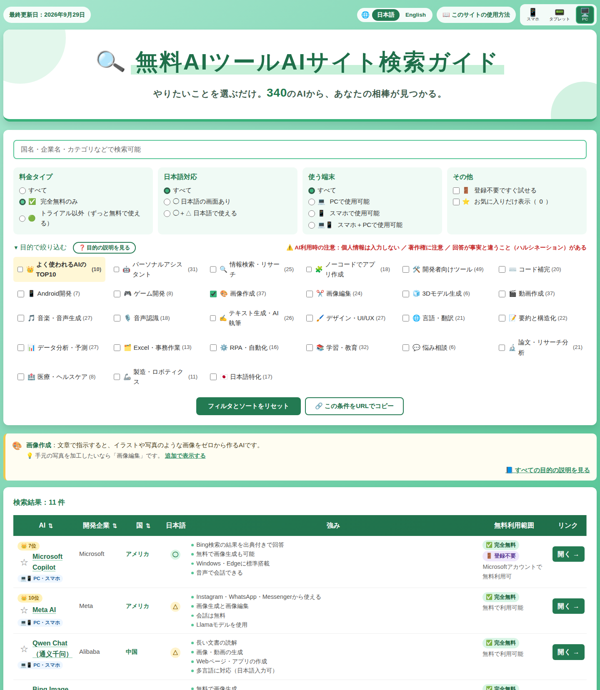
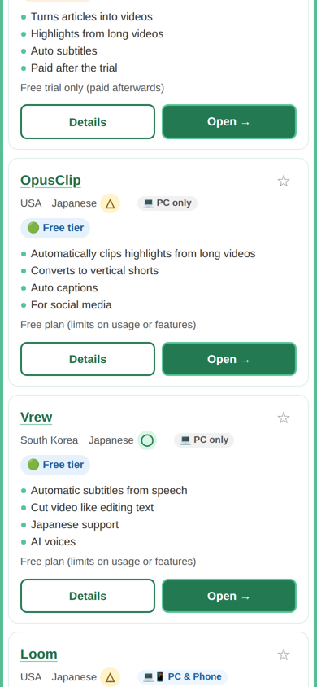

# 🔍 無料AIツールAIサイト検索ガイド / Free AI Tools Finder

**やりたいことを選ぶだけ。340以上の無料で使えるAIから、あなたの相棒が見つかる。**
*Just pick what you want to do. Find your AI partner among 340+ free AI tools.*

### 👉 [サイトを開く / Open the site](https://ma0531.github.io/ai-tools-search-guide/)

[日本語](#日本語) ｜ [English](#english)

  
  &nbsp;
  

---

## 日本語

### どんなサイト？

「画像を作りたい」「会議の文字起こしをしたい」「Excel作業を楽にしたい」など、**やりたいことから、無料で使えるAIツールを探せる**検索サイトです。世界中の340以上のAIについて、強み・無料で使える範囲・開発企業の国・日本語対応などを一覧で比べられます。

### できること

| 機能 | 内容 |
|------|------|
| 🎯 目的で絞り込む | 画像作成・動画作成・翻訳・RPA・Android開発など27の目的から選べる |
| 👑 よく使われるAIのTOP10 | 世界でよく使われているAIを順位付きで表示 |
| 💰 料金タイプ | 「完全無料のみ」「トライアル以外」で絞り込み |
| 🇯🇵 日本語対応 | 日本語で使えるAIだけを表示 |
| 💻📱 使う端末 | PC・スマホのどちらで使えるかで絞り込み |
| 🚪 登録不要 | アカウントなしですぐ試せるAIだけを表示 |
| 🔍 キーワード検索 | AI名だけでなく、国名・企業名・できることでも検索 |
| ⭐ お気に入り | 気になるAIを保存（登録不要） |
| 🔗 条件の共有 | 絞り込んだ状態をURLで共有 |
| 📘 目的の説明 | 各目的の意味や、迷いやすい組み合わせの違いを解説 |
| 🌐 日本語 / English | ボタン1つで英語表示に切り替え |
| 📱 スマホ対応 | スマホではカード形式で見やすく表示 |
| ♿ アクセシビリティ | 読み上げソフト・キーボード操作・音声操作に対応 |

### 使い方

1. 検索欄にキーワードを入れるか、「目的で絞り込む」でやりたいことを選びます
2. 料金タイプ・日本語対応・使う端末で、さらに絞り込みます
3. AIの名前を押すと詳しい説明が、「開く →」を押すと公式サイトが開きます

詳しい使い方は、サイト内の「📖 このサイトの使用方法」をご覧ください。

### ⚠️ AIを使うときの注意

- 名前・住所・パスワードなどの**個人情報や、会社の秘密情報は入力しない**でください
- AIで作ったものでも、**著作権**の問題になることがあります。仕事で使う前に各サービスの利用規約を確認してください
- AIは事実と違う内容を答えることがあります（**ハルシネーション**）。大事な情報は必ず確認してください
- 無料の範囲や料金は、各サービスの都合で変わることがあります

### 情報の誤り報告・掲載リクエスト

リンク切れや情報の間違い、「このAIも載せてほしい」というご要望は、[こちらのフォーム](https://forms.gle/EiuK2cFBpW7pL8ai7)からお送りください（アカウント不要）。

### しくみ（開発者向け）

- **サイト**：HTML / CSS / JavaScript のみ（フレームワークなし）、GitHub Pagesで公開
- **データ管理**：`data/ai-tools.xlsx` を更新すると、GitHub Actionsが自動で `data/ai-tools.json` に変換（入力ミスがあれば変換を止めて場所を表示）
- **リンク切れチェック**：GitHub Actionsが毎週すべてのURLを確認し、結果をIssuesに報告

### 制作について

このサイトは、Anthropic社のAI「**Claude Opus 5.5**」の支援を受けて作成しました。サイトの設計・プログラム・AIツールの説明文や英訳の作成などにClaudeを活用し、内容の確認と運営は制作者が行っています。

AIが作成した説明文には、誤りが含まれる可能性があります。お気づきの点があれば、上記のフォームからお知らせください。
---

## English

### What is this?

A search site for finding **free AI tools by what you want to do** — create images, transcribe meetings, automate office work, and more. Compare 340+ AI tools from around the world by strengths, free usage, developer country, Japanese support and supported devices.

### Features

| Feature | Description |
|---------|-------------|
| 🎯 Filter by purpose | 27 categories including image generation, video, translation, RPA and Android development |
| 👑 Top 10 Most-Used AI | The world's most-used AI tools, ranked |
| 💰 Price | Show completely free tools only, or exclude trial-only tools |
| 🇯🇵 Japanese support | Show only tools that work in Japanese |
| 💻📱 Devices | Filter by PC, phone, or both |
| 🚪 No sign-up | Show only tools you can try without an account |
| 🔍 Keyword search | Search by name, country, company or what a tool does |
| ⭐ Favorites | Save tools you like (no account needed) |
| 🔗 Share filters | Share your current filters as a URL |
| 📘 Categories explained | Explanations of each category and commonly confused pairs |
| 🌐 日本語 / English | Switch languages with one click |
| 📱 Mobile-friendly | Card layout on phones |
| ♿ Accessibility | Works with screen readers, keyboard and voice control |

### How to use

1. Type a keyword, or choose what you want to do under "Filter by purpose"
2. Narrow down further by price, Japanese support and devices
3. Click an AI's name for details, or "Open →" to visit its official site

See "📖 How to use this site" on the site for more.

### ⚠️ Using AI safely

- **Never enter personal or confidential information** such as names, addresses or passwords
- AI-generated content can still raise **copyright** issues. Check each service's terms before using results for work
- AI can state false information convincingly (**hallucinations**). Always verify important information
- Free usage and pricing can change at any time

### Report errors / request an AI

Found a broken link or wrong information, or want an AI added? Use [this form](https://forms.gle/EiuK2cFBpW7pL8ai7) (no account needed).

### How it works (for developers)

- **Site**: plain HTML / CSS / JavaScript (no framework), hosted on GitHub Pages
- **Data**: updating `data/ai-tools.xlsx` triggers GitHub Actions to convert it into `data/ai-tools.json` (the conversion stops and points out any input errors)
- **Link checking**: GitHub Actions checks every URL weekly and reports the results in Issues

### About this project

This site was created with the help of **Claude Opus 5.5**, an AI model by Anthropic. Claude assisted with the site design, code, tool descriptions and English translations, while the creator reviews the content and runs the site.

AI-written descriptions may contain errors. If you spot any, please let us know through the form above.